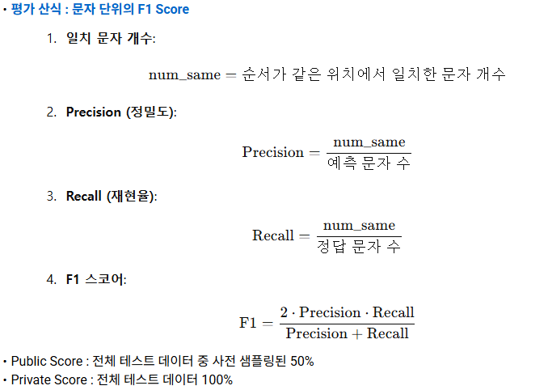

# 난독화된 한글 리뷰 복원 AI 경진대회 - DACON

### 주제 : 식별하기 어렵게 쓴 한글 리뷰를 원래 한글 리뷰로 복원하는 AI 알고리즘 개발
### 링크 : https://dacon.io/competitions/official/236446/overview/description
### 기간 : 2025-01-06 ~ 2025.02.28
### 평가 산식 : 문자 단위의 F1 Score

### 외부 데이터 및 API / 사전 학습 모델
* 외부 데이터 사용 금지
* 학습 데이터 증강 가능
* ChatGPT, Cluade 같은 모델의 코드와 가중치가 공개되지 않은 LLM으로 증강 또는 전처리 불가
* 공식 공개 사전 학습 모델 사용 가능
* 유료 LLM 모델 API 사용 금지